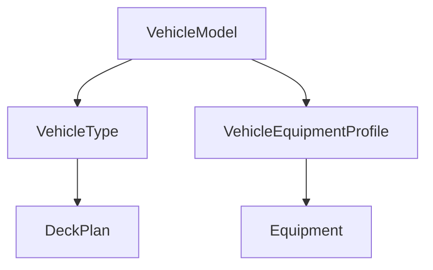

# NeTEx based Vehicle Registry

This repository contains documentation, examples and decisions for a NeTEx based vehicle registry. It defines which NeTEx elements are used, their definitions and modeling conventions. The focus lies on passenger related data such as:
- accessibility data (covers the [german DELFI  handbook "Barrierefreie Reiseketten in der Fahrgastinformation"](https://www.delfi.de/media/delfi_handbuch_barrierefreie_reiseketten_2._auflage_2024.pdf))
- deck plan data to facilitate seat reservation, seat map generation and onboard navigation
- other: environmental data, capacity data, equipment, accommodations

## Core elements:


### Main file structure

```xml
<?xml version="1.0" encoding="UTF-8"?>
<PublicationDelivery
  xmlns="http://www.netex.org.uk/netex"
  xmlns:siri="http://www.siri.org.uk/siri"
  xmlns:gml="http://www.opengis.net/gml/3.2"
  xmlns:xsi="http://www.w3.org/2001/XMLSchema-instance"
  version="any"
>
  <PublicationTimestamp>2020-12-17T09:30:47.0Z</PublicationTimestamp>
  <ParticipantRef>SYS001</ParticipantRef>
  <dataObjects>
    <ResourceFrame version="any" id="ResourceFrame/id/1">
      <equipments> ... </equipments>

      <vehicleTypes> ... </vehicleTypes>

      </vehicleModels> ... <vehicleModels>

      </vehicleEquipmentProfiles> ... <vehicleEquipmentProfiles>

      <deckPlans> ... </deckPlans>
    </ResourceFrame>
  </dataObjects>
</PublicationDelivery>
```
